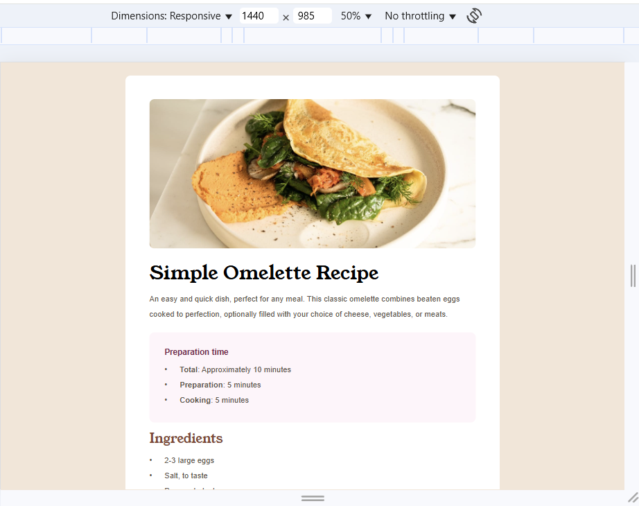
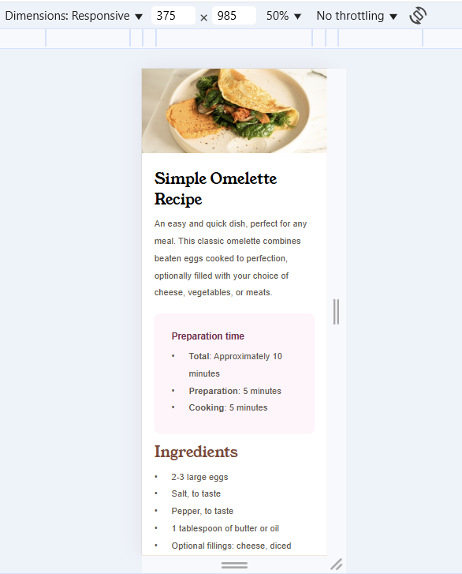

# Frontend Mentor - Recipe page


This is a solution to the [Recipe page challenge on Frontend Mentor](https://www.frontendmentor.io/challenges/recipe-page-KiTsR8QQKm).

## Table of contents

- [Overview](#overview)
  - [The challenge](#the-challenge)
  - [Screenshot](#screenshot)
  - [Links](#links)
- [My process](#my-process)
  - [Built with](#built-with)
  - [What I learned](#what-i-learned)

# Frontend Mentor - Recipe page solution

Frontend Mentor challenges help you improve your coding skills by building realistic projects.

## Table of contents

- [Overview](#overview)
  - [Screenshot](#screenshot)
  - [Links](#links)
- [My process](#my-process)
  - [Built with](#built-with)
  - [What I learned](#what-i-learned)

## Overview

### Screenshot




### Links

- Solution URL: [Add solution URL here](https://github.com/Hary300/Recipe-page)
- Live Site URL: [Add live site URL here](https://hary300.github.io/Recipe-page/)

## My process

### Built with

- Semantic HTML5 markup
- CSS custom properties
- Flexbox
- CSS Grid

### What I learned

```css
@font-face {
  font-family: 'outfit';
  src: url('./assets/fonts/outfit/Outfit-VariableFont_wght.ttf'); /* adding an internal custom font */
}

/* list code */
/* Distance custom using ::before */

ol.custom {
  padding-left: 45px;
  line-height: 28px;
  font-size: 18px;
  line-height: 35px;
}

ol.custom li::marker {
  content: counter(list-item) '.      ';
  color: hsl(30, 10%, 34%);
}

ol.custom li {
  color: hsl(30, 10%, 34%);
}

/* Distance custom using ::marker */
ul.custom {
  list-style-type: none;
  font-size: 18px;
  padding-left: 0px;
  line-height: 35px;
  color: hsl(30, 10%, 34%);
}

ul.custom li {
  position: relative;
  padding-left: 35px;
}

ul.custom li::before {
  content: '•';
  position: absolute;
  left: 0;
}
```

- border-collapse: collapse; → makes table borders merge into a single line.
- list-style-type: none; → removes the default bullets/numbers from a list.
- content: counter(list-item) '. '; → adds automatic numbering (1., 2., 3., …) using a CSS counter. ✅
  content: "[" counter(list-item) "] "; → [1]
  content: ">> " counter(list-item) " << "; → >> 1 <<
- using -margin/padding to ignore the wrapper's margin/padding

# Front-end Style Guide

## Layout

The designs were created to the following widths:

- Mobile: 375px
- Desktop: 1440px

## Colors

- White: hsl(0, 0%, 100%)

- Stone 100: hsl(30, 54%, 90%)
- Stone 150: hsl(30, 18%, 87%)
- Stone 600: hsl(30, 10%, 34%)
- Stone 900: hsl(24, 5%, 18%)

- Brown 800: hsl(14, 45%, 36%)

- Rose 800: hsl(332, 51%, 32%)
- Rose 50: hsl(330, 100%, 98%)

## Typography

### Body Copy

- Font size (paragraph): 16px

### Fonts

- Family: [Young Serif](https://fonts.google.com/specimen/Young+Serif)
- Weights: 400

- Family: [Outfit](https://fonts.google.com/specimen/Outfit)
- Weights: 400, 600, 700
